# V0 Private Compute Network — Diagrams

> **Date:** 2026-04-11
> **Companion to:** `PRIVAI_V0_DIRECTION_RESET_PRIVATE_COMPUTE_NETWORK.md`
> **Status:** Visual companion for V0 canonical direction
> **Rule:** Where this doc and old `PRIVAI_PRODUCTION_SYSTEM_DIAGRAMS.md` conflict on framing, this doc wins.

---

## 1. V0 System Stack [canonical V0 direction]

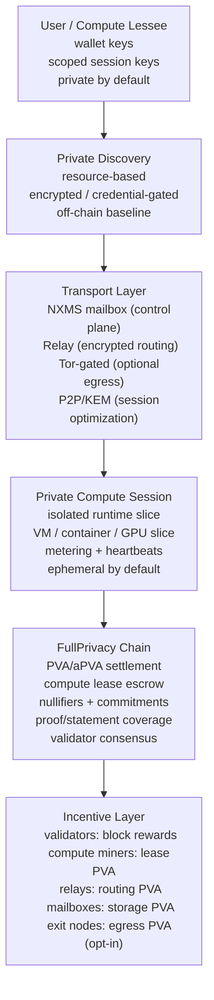

Rules:
- Privacy is the product. Compute is the supply. PVA is the incentive.
- Chain sees commitments, not workloads.
- Discovery is private, not a public marketplace.
- All ledger accounting uses aPVA, never floats.

---

## 2. Node Roles [canonical V0 direction]

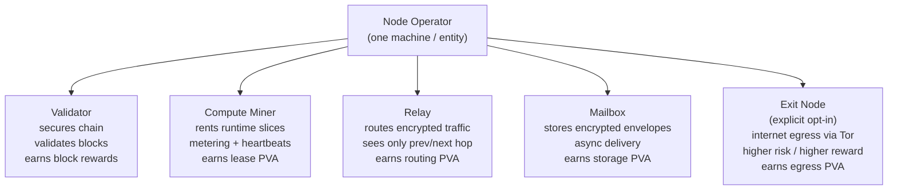

Rules:
- One machine may run multiple roles. Protocol must not merge them.
- Validator ≠ compute miner at protocol level.
- Exit node is never default. Explicit opt-in only.
- Each role has separate stake/bond requirements.
- Relay sees only immediate neighbors (onion model).

---

## 3. Compute Lease Lifecycle [canonical V0 direction]

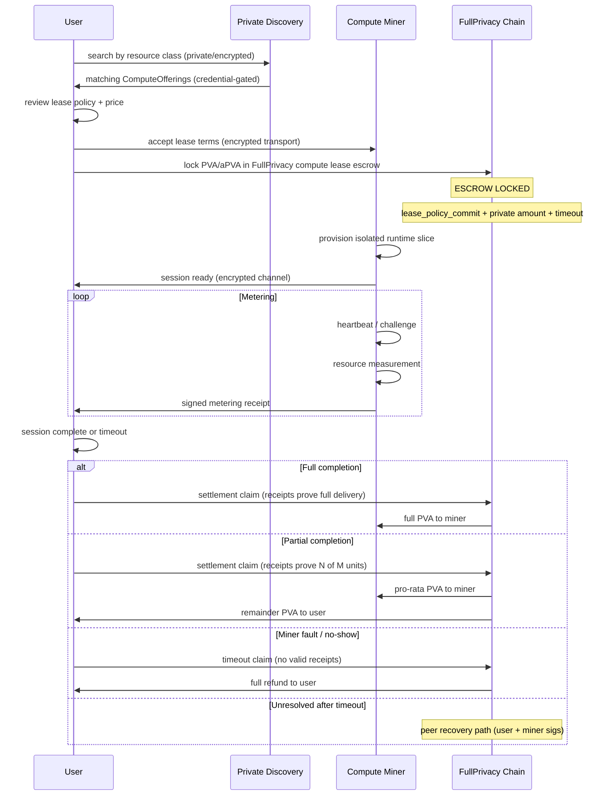

Rules:
- Discovery is private, not a public marketplace browse.
- Escrow locks before session starts.
- Settlement is receipt-based, not quality-based.
- Pro-rata split is the expected norm for timed compute.
- Operatorless settlement is the canonical target.

---

## 4. On-Chain vs Off-Chain Boundary [canonical V0 direction]

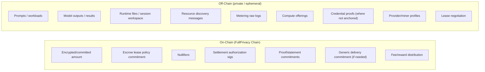

Rules:
- Chain must not become a marketplace, registry, profile directory, or service graph.
- Chain sees generic commitments, not business semantics.
- Workloads, outputs, and model data never touch the chain.
- All off-chain data is ephemeral by default; persistent storage is explicit opt-in.

---

## 5. FullPrivacy Escrow Boundary [canonical V0 direction]

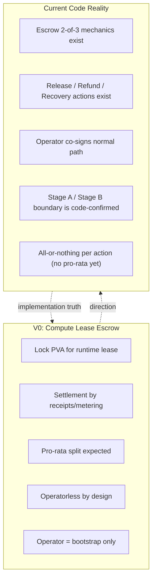

Rules:
- V0 sets the direction: operatorless, receipt-based, pro-rata.
- Current code still uses 2-of-3 with operator. This is bootstrap, not final.
- Pro-rata split requires new mechanics not yet implemented.
- Stage A / Stage B boundary is unchanged by V0.
- Recovery path (user + miner after timeout, no operator) already aligns with V0 direction.

---

## 6. Private Discovery Flow [canonical V0 direction]

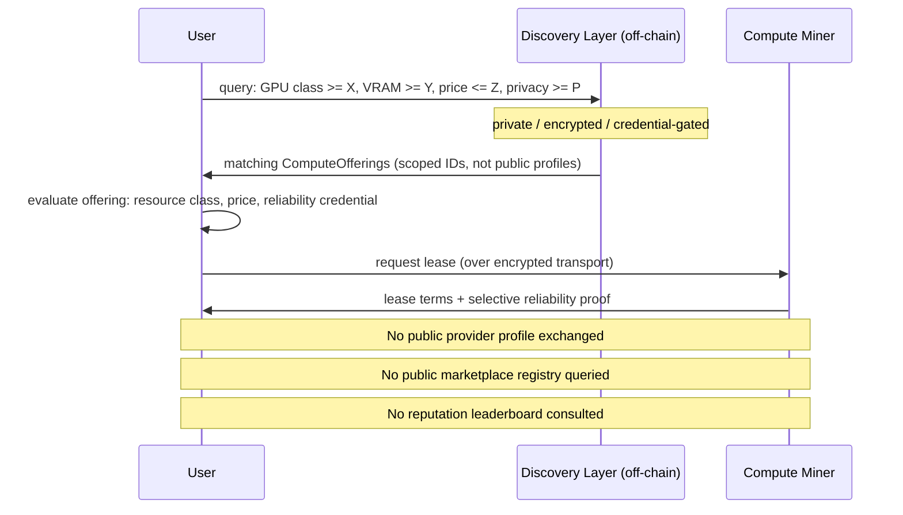

Rules:
- User searches by resource requirements, not by provider identity.
- Discovery is off-chain, private, credential-gated as baseline.
- Public discovery is lower-privacy opt-in, never default.
- Compute miner exposes scoped offering ID, not permanent public identity.
- Reliability is proven selectively, not published on a leaderboard.

---

## 7. Runtime Network Modes [canonical V0 direction]

```mermaid
flowchart TD
    subgraph ISOLATED["isolated (default)"]
        I1["Runtime slice"] -.-x I2["Internet"]
        I1 <-->|"P2P/KEM tunnel"| I3["User"]
    end

    subgraph NXMS_ONLY["nxms_only"]
        N1["Runtime slice"] <-->|"NXMS mailbox"| N2["privAI network only"]
        N1 -.-x N3["Internet"]
    end

    subgraph TOR_GATED["tor_gated"]
        T1["Runtime slice"] -->|"encrypted multi-hop"| T2["privAI relays"]
        T2 -->|"exit to Tor"| T3["Exit node (opt-in)"]
        T3 -->|"Tor circuit"| T4["Internet"]
    end

    subgraph INTERNET_EXIT["internet_exit (explicit opt-in)"]
        E1["Runtime slice"] -->|"direct"| E2["Internet"]
        Note over E1,E2: "Miner IP leaks. Higher price. Explicit acceptance required."
    end
```

Rules:
- `isolated` is the default. No external network.
- `nxms_only` allows privAI-internal communication only.
- `tor_gated` routes through relay hops + Tor. Compute miner cannot see destination.
- `internet_exit` is never default. Explicit opt-in by miner. IP exposure acknowledged.
- Exit node is a separate role from compute miner.

---

## 8. Transport / Mailbox / Relay Privacy [canonical V0 direction]

```mermaid
flowchart LR
    U["User"] -->|"encrypted payload"| MB["Mailbox
    stores encrypted envelopes
    cannot read content"]

    MB -->|"encrypted delivery"| CM["Compute Miner
    receives encrypted payload
    decrypts only own session"]

    CM -->|"encrypted outbound"| R1["Relay hop 1
    sees prev + next only"]
    R1 -->|"encrypted"| R2["Relay hop N
    sees prev + next only"]
    R2 -->|"exit handoff"| EX["Exit Node
    sees traffic to Tor
    cannot see origin"]
    EX -->|"Tor circuit"| INT["Internet"]
```

Rules:
- Mailbox stores encrypted envelopes. Cannot read content.
- Each relay sees only its immediate predecessor and successor.
- No single node learns the full route.
- Compute miner cannot determine if traffic exits to internet.
- Metadata minimization is a core priority, not a future nice-to-have.

---

## 9. Metering / Receipt Flow [canonical V0 direction]

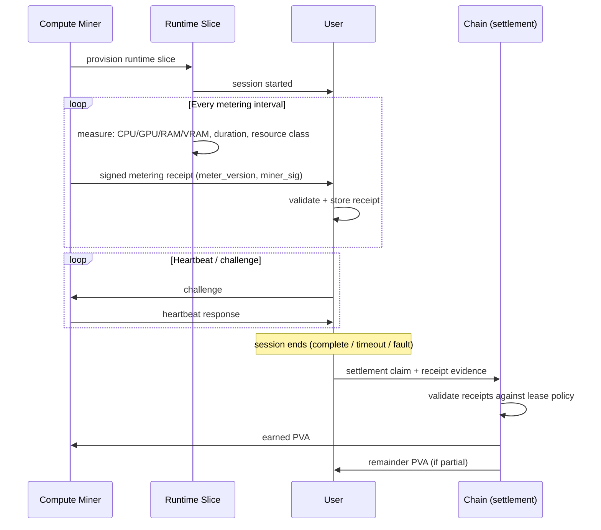

Rules:
- Metering uses same protocol for all compute miners (not same physical sensor).
- Every receipt is signed by miner with meter_version declared.
- Heartbeats detect liveness; missed heartbeats count against reliability.
- Settlement validates receipts against lease policy, not subjective quality.
- Wire format of receipts is a future protocol spec — not defined here.

---

## 10. Reliability Scoring [canonical V0 direction]

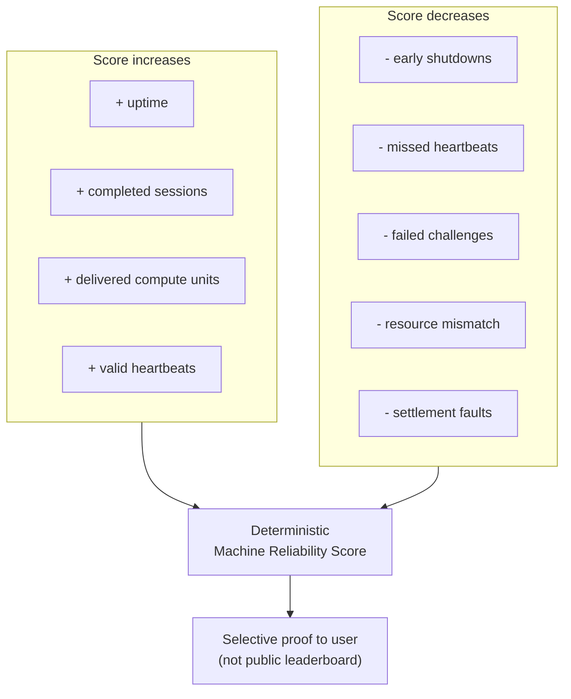

Rules:
- This is deterministic machine reliability, not human reputation.
- No subjective AI quality score. No human review. No public leaderboard baseline.
- Score is proven selectively to requesting users, not broadcast.
- Exact formula weights are a future protocol spec — not defined here.
- Energy telemetry supports fraud detection and audit, not direct payment.

---

## 11. Protocol Version Domains [canonical V0 direction]

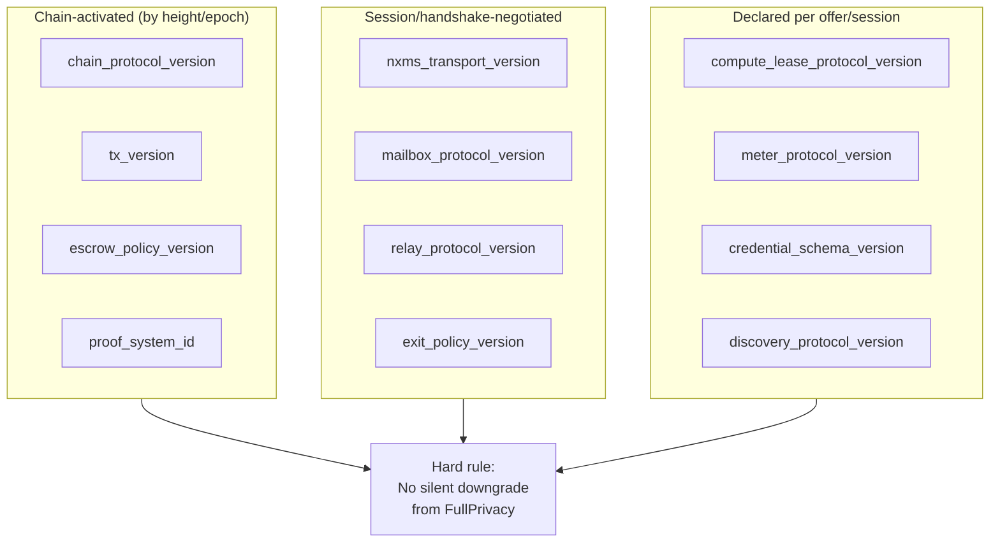

Rules:
- 12 explicit version domains. Each versioned independently.
- Chain versions activate by height or epoch.
- Transport/relay/mailbox versions negotiate in handshake.
- Lease/meter/credential versions declared per session.
- No silent downgrade from FullPrivacy to lower privacy. Ever.
- If a task introduces a new format, it must state version impact.

---

## 12. Legacy Framing Rejected [canonical V0 direction]

```mermaid
flowchart LR
    subgraph REJECTED["NOT the V0 model"]
        R1["Public AI marketplace"]
        R2["Public provider profile"]
        R3["Skill pack registry on-chain"]
        R4["Quality-of-answer settlement"]
        R5["Operator as canonical escrow decision-maker"]
        R6["MarketplaceBatchTx as product center"]
        R7["Public reputation leaderboard"]
        R8["Artifact delivery as center of settlement"]
    end

    subgraph CANONICAL["V0 canonical model"]
        C1["Private compute network"]
        C2["Hidden root + scoped identity"]
        C3["Private resource-based discovery"]
        C4["Receipt / metering settlement"]
        C5["Operatorless escrow by design"]
        C6["FullPrivacy compute lease escrow"]
        C7["Deterministic machine reliability"]
        C8["Compute session as center"]
    end

    REJECTED -->|"replaced by"| CANONICAL
```

Rules:
- If old docs say "marketplace" and V0 says "private compute network", V0 wins.
- If old docs say "provider" and V0 says "compute miner", V0 wins.
- If old docs say "quality settlement" and V0 says "receipt settlement", V0 wins.
- Deep-spec mechanical truth (Stage A/B, Halo2 boundary, transport split) is NOT rejected.
- Legacy docs remain as mechanical reference where not contradicted by V0.

---

## 13. Identity Layers [canonical V0 direction]

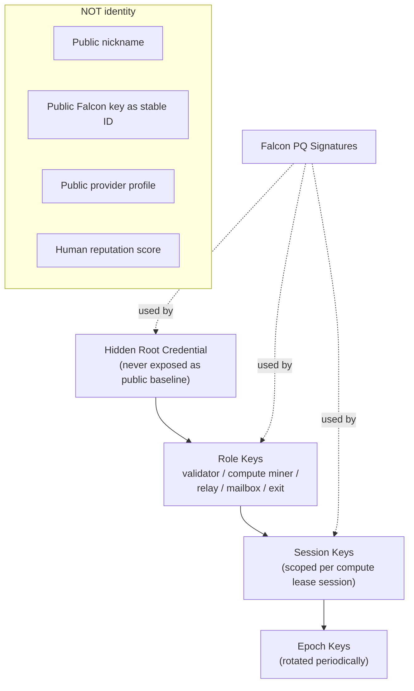

Rules:
- Identity = hidden root + scoped role/session/epoch keys.
- Falcon is a signing tool, not the identity itself.
- No public profile as privacy baseline.
- Validator identity is separate from compute miner identity.
- Credential format is a future protocol spec — not defined here.

---

## 14. Operatorless Escrow Transition [future strengthening]

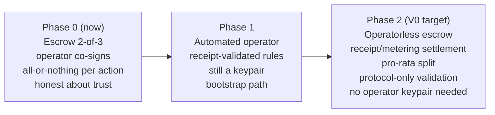

Rules:
- Phase 0 is current reality. Operator co-signs. All-or-nothing. This is bootstrap.
- Phase 1 automates operator decisions based on receipts. Still uses operator key.
- Phase 2 removes operator entirely. Settlement is protocol-validated from receipts.
- Pro-rata split requires new escrow mechanics (not yet implemented).
- Recovery path (user + miner after timeout) already works without operator.

---

## 15. Compute Offering Object [canonical V0 direction]

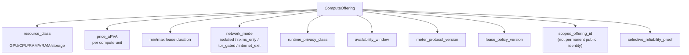

Rules:
- This is what users discover. Not a provider profile. Not a skill pack.
- Offering ID is scoped, not a permanent public identifier.
- Reliability is proven selectively, not published.
- Price is in aPVA. All protocol accounting uses aPVA.
- Exact schema is a future protocol spec — this is direction only.

---

*Document version: 2026-04-11. Visual companion for V0 Direction Reset. Does not override deep-spec mechanical truth (Stage A/B boundary, Halo2 proof boundary, transport split). Where this doc and old diagrams doc conflict on product/business framing, this doc wins.*
