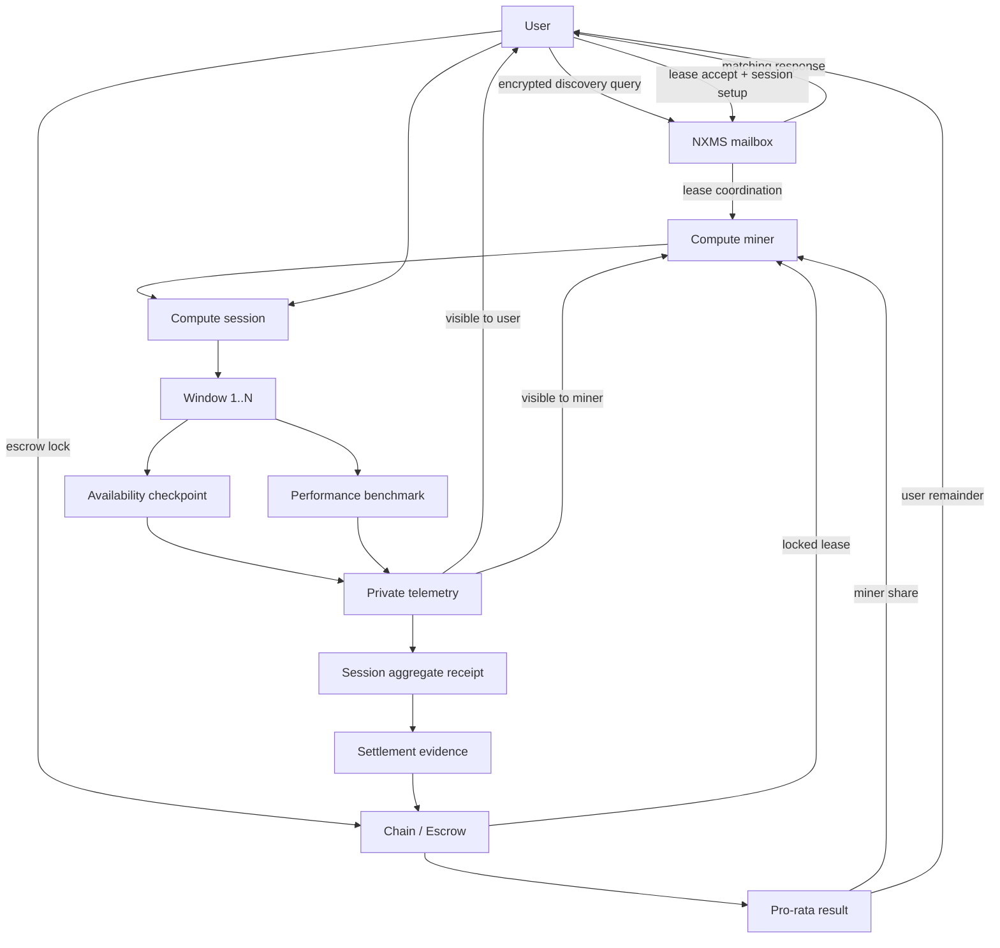

# privAI V0: Wide-Spectrum Architecture — Hidden Solutions

**Status:** architecture deep analysis  
**Data:** 2026-04-12  
**Źródło:** PRIVAI_V0_DIRECTION_RESET_PRIVATE_COMPUTE_NETWORK.md, PRIVAI_V0_DIAGRAMS.md, PRIVAI_V0_DOCS_TREE.md, audyty kodu P-T040–P-T060  
**Zakres:** szerokopasmowe myślenie o finalnej architekturze — rozwiązania w miejscach gdzie na pierwszy rzut oka ich nie ma

---

## Fundamentalna zmiana perspektywa

Większość dyskusji o V0 koncentruje się na poszczególnych problemach: receipts, pro-rata, identity, discovery. Ale największy insight jest inny:

**V0 buduje prywatną infrastrukturę compute. Kto kontroluje infrastrukturę, kontroluje przyszłość AI.**

System nie sprzedaje modeli AI. System sprzedaje prywatny dostęp do compute. Kto ma GPU i chce wynająć — publikuje ofertę. Kto potrzebuje compute — leasuje. Settlement jest automatyczny. Nikt nie widzi co było obliczane.

To jest infrastruktura platformowa. Jak AWS, ale prywatna, zdecentralizowana, z automatycznym settlement.

---

## Problem 1: Receipt Truth — Challenge-Sampled Proof of Resource Possession

**Standardowe myślenie:** Self-reported receipts → challenge/response → TEE attestation.

**Problem z TEE:** TEE wymaga zaufania do producenta hardware (Intel/AMD/ARM). V0 nie chce nikomu ufać na słowo. TEE jest opcjonalne bo system MUSI działać bez zaufania do kogokolwiek.

**Niewidoczne rozwiązanie: Nie dowód przeszłości — weryfikacja stanu w czasie.**

Stary model pyta: "Czy miner dostarczył 7 godzin?" → trudne do udowodnienia bez zaufania.

Nowy model pyta: "Czy miner MA zasób TERAZ? I TERAZ? I TERAZ?" → weryfikowalne bez zaufania.

**Jak to działa:**

```
1. Protocol generuje deterministyczne challengi w trakcie sesji
   challenge_hash = hash(session_id || block_height || epoch_entropy)
   
2. Miner odpowiada proof of possession
   - Computation challenge: losowy problem wymagający GPU
   - Result jest deterministyczny — każdy może verify
   - Jeśli miner nie ma GPU → nie może wykonać w czasie
   
3. Receipt = aggregate proof of possession
   challenges_passed / challenges_issued = possession_ratio
   
4. Settlement = possession_ratio * total_amount
   700/1000 passed = 70% delivery = 70% payment
```

**Dlaczego to jest trustless:**

1. Challenge jest deterministyczny — każdy może odtworzyć te same challengi
2. Proof of possession jest verifiable — computation result jest deterministyczny
3. Miner nie może oszukiwać między challengami — challengi są losowe w czasie
4. Economic incentive jest aligned — więcej passed = więcej PVA
5. Nie wymaga zaufania do nikogo — nie do minera, nie do hardware, nie do third party

**Bond + Slash jako warstwa ekonomiczna:**

```
Miner deponuje bond (N PVA) przy rejestracji.
Jeśli possession_ratio < threshold (np. 80%) — bond partially slashed.
Jeśli possession_ratio < critical (np. 50%) — bond fully slashed.
Slashed PVA → user (compensation) lub protocol treasury.
```

**Nazewnictwo:** Nie "proof of delivery" — to jest **challenge-sampled proof of resource possession** albo **proof of reserved capacity**.

**Co to dowodzi:**
- Miner miał i utrzymywał zdolność zasobową przez część czasu ✓

**Co to NIE dowodzi:**
- Że miner dostarczył wszystko ✗
- Że zasób był wyłącznie zarezerwowany dla usera ✗
- Że realnie wykonywał workload usera cały czas ✗

**Otwarte dziury (future protocol spec):**

1. **Timing** — kto definiuje deadline challenga bez zaufanego zegara?
2. **Exclusivity** — miner może oversubscribe GPU wielu userom
3. **GPU proof difficulty** — wynik nie zawsze dowodzi GPU class (wolniejszy zasób + więcej czasu)
4. **Sampling gaps** — między challengami jest luka (statystyka pomaga, ale nie jest ciągły dowód)
5. **Verifier model** — kto zbiera odpowiedzi? On-chain czy off-chain?

**TEE jako opcjonalne wzmocnienie (nie baza):**

```
Base layer: challenge-sampled proof of possession (trustless)
Optional layer: TEE attestation (jeśli miner ma — dodatkowa gwarancja)
Optional layer: third-party attestation (jeśli dostępne)

System MUSI działać na base layer. Opcjonalne warstwy są bonus, nie requirement.
```

**Phase evolution:**

```
Phase 1: Self-reported receipts + automated operator (bridge)
Phase 1.5: Challenge-sampled possession proof (jeśli protocol jest gotowy)
Phase 2: Possession proof jako primary settlement evidence
         Bond/slash required dla high-value leases
         TEE optional (jeśli miner ma)
Phase 2+: Third-party attestation optional
          Continuous proof (future research)
```

---

## Problem 2: Amount system — dual-track już działa

**Standardowe myślenie:** Amount14 (max 16,383) to problem. Potrzebujemy większego typu.

**Niewidoczne rozwiązanie: Dual-track amount już działa w kodzie.**

Kod ma:
- `OutputNote.ct_amt: LweCiphertext` — encrypted amount w nocie (proof lane, Amount14)
- `LiteOutputNote.amount: u64` — jawna kwota w nocie (ledger lane)
- `TxCore.fee: u64` — fee transakcji (ledger lane)
- `Receipt.amount: u64` — kwota receipt (ledger lane)
- `SettlementBatchSummary.total_gross_amount: u64` — kwota settlement (ledger lane)

**To nie jest przypadek.** Kod już rozdziela encrypted amounts (Amount14) od economic amounts (u64). `LiteOutputNote` jest dowodem że system może mieć jawne kwoty w nocie bez LWE encryption.

**Jak to działa w V0:**

```
Escrow lock: on-chain commitment do LedgerAmount (u64)
  ├── OutputNote (encrypted, Amount14) — dla privacy-preserving notes
  └── LiteOutputNote (plain, u64) — dla notes które nie potrzebują encryption

Settlement: pro-rata na LedgerAmount (u64) — integer arithmetic
  ├── Miner share = total * delivered / committed
  └── User share = total - miner share

Proof: Halo2 dowodzi że encrypted amount jest poprawny
  ├── Amount14 w proof circuit
  └── LedgerAmount w commitment (nie w proof)
```

---

## Problem 3: Identity — dwa niezależne klucze wystarczą

**Standardowe myślenie:** Potrzebujemy hidden root → role keys → session keys → epoch keys. To jest duży redesign.

**Niewidoczne rozwiązanie: Falcon PK = ValidatorRoleKey jest wystarczające na Phase 0-5.**

Consensus używa Falcon PK jako validator identity. To działa. Nie trzeba tego zmieniać.

Compute miner potrzebuje osobnego klucza. Ale compute miner NIE jest częścią consensus. Compute miner nie głosuje, nie produkuje bloków. Compute miner podpisuje receipts i lease claims.

**Jak to działa bez redesignu:**

```
Phase 0-1:
  Validator = obecny Falcon PK (z vault) = node_pk_hash
  Compute miner = NOWY Falcon PK (generowany osobno, nie z vault)
  
  Dwa różne klucze. Dwie różne tożsamości. Zero coupling.
  
  Validator używa klucza do voting i block signing.
  Compute miner używa klucza do signing receipts i lease claims.
  
  Żaden z nich nie wie o drugim.
```

**Dlaczego nie widać tego:** Bo dyskusja o identity koncentruje się na "hidden root + full hierarchy." Ale na Phase 0-5 wystarczą dwa niezależne klucze. Hidden root jest Phase 6+ concern.

**Implikacja:** Compute miner może zacząć działać BEZ zmiany consensus identity. Nowy klucz jest generowany osobno. Receipts są podpisane nowym kluczem. Settlement działa.

---

## Problem 4: RecoveryRelease — fundament operatorless

**Standardowe myślenie:** RecoveryRelease jest edge case — co się dzieje gdy timeout mija.

**Niewidoczne rozwiązanie: RecoveryRelease jest architektonicznym fundamentem całego operatorless modelu.**

RecoveryRelease jest JEDYNĄ akcją która działa bez operatora. User + Miner podpisują. Bez operatora. Timeout enforced.

To jest dowód że operatorless settlement JUŻ DZIAŁA w kodzie. Tylko dla recovery. Ale mechanika jest ta sama dla normalnego settlement.

**Jak to działa:**

```
Phase 0 (teraz):
  Release: User + Operator → Merchant
  Refund: Miner + Operator → User
  RecoveryRelease: User + Miner → (split)  ← OPERATORLESS

Phase 1:
  Release: User + AutomatedOperator → Merchant
  Refund: User + AutomatedOperator → User
  RecoveryRelease: User + Miner → (split)  ← OPERATORLESS

Phase 2:
  Release: User + Protocol → Merchant      ← OPERATORLESS (jak RecoveryRelease)
  Refund: User + Protocol → User           ← OPERATORLESS (jak RecoveryRelease)
  RecoveryRelease: User + Miner → (split)  ← OPERATORLESS
```

**Kluczowa insight:** Phase 2 "Protocol" jest jak "Miner" w RecoveryRelease — nie jest ludzkim sygnatariuszem, jest protocol-level validation. Mechanika jest ta sama: 2 sygnatariuszy, z których jeden jest "protocol-level entity."

---

## Problem 5: Discovery — NXMS mailbox już jest transportem

**Standardowe myślenie:** Potrzebujemy nowy discovery protocol — encrypted registry, DHT, gossip.

**Niewidoczne rozwiązanie: NXMS mailbox JUŻ jest discovery transportem.**

NXMS mailbox przechowuje encrypted envelopes. Nie widzi treści. Push/pull/ack.

Discovery query = encrypted envelope wysłany przez mailbox. Miners pullują envelope'y. Każdy miner próbuje odszyfrować. Jeśli pasuje — odpowiada. Jeśli nie — ignoruje.

**Jak to działa:**

```
User → Mailbox: [encrypted query: GPU >= A100, price <= 10 PVA/h]
Mailbox → Miners: pull (każdy miner widzi envelope, nie widzi treści)
Miner 1: decrypt → nie pasuje (ma T4) → ignore
Miner 2: decrypt → pasuje (ma A100) → respond
Miner 3: decrypt → pasuje (ma H100) → respond
Miner 2 → Mailbox: [encrypted response: ComputeOffering]
Miner 3 → Mailbox: [encrypted response: ComputeOffering]
Mailbox → User: pull responses
```

**Co mailbox widzi:** Envelope'y są wysyłane i odbierane. Mailbox nie widzi treści. Mailbox nie wie kto ma jaki GPU.

**Problem:** Miners którzy nie matchują i tak pullują envelope — to jest wasted work i potential metadata leak (kto pullnął = kto jest aktywnym minerem).

**Rozwiązanie:** Mailbox może routować query do miners na podstawie encrypted resource class hint (minimalny metadata, wystarczający żeby nie wysyłać GPU query do CPU-only miners).

---

## Problem 6: Automated operator jako funkcja, nie serwis

**Standardowe myślenie:** Automated operator jest osobnym serwisem który waliduje receipts.

**Niewidoczne rozwiązanie: Automated operator może być funkcją w ledger, nie osobnym serwisem.**

```rust
fn validate_compute_lease_settlement(
    receipts: &[ComputeLeaseReceipt],
    lease_policy: &ComputeLeasePolicy,
    timeout_passed: bool,
) -> SettlementDecision {
    if receipts_valid(receipts, lease_policy) && full_coverage(receipts, lease_policy) {
        Release(compute_miner_share(receipts, lease_policy))
    } else if receipts.is_empty() && timeout_passed {
        Refund(full_amount(lease_policy))
    } else if partial_coverage(receipts, lease_policy) {
        ProRata(miner_share(receipts, lease_policy), user_share(receipts, lease_policy))
    }
}
```

Ta funkcja jest deterministyczna. Te same inputs → te same outputs. Każdy może ją wywołać i dostać ten sam wynik.

**Phase 1:** Operator key co-signs wynik tej funkcji. Ale decyzja jest z funkcji, nie z ludzkiego osądu.
**Phase 2:** Funkcja działa bezpośrednio w walidacji ledger. Operator key nie jest potrzebny.

**Implikacja:** Phase 1 → Phase 2 jest proste — usunąć operator key z auth requirements. Logika walidacji jest ta sama.

---

## Problem 7: Pro-rata nie wymaga nowej mechaniki note split (Phase 1)

**Standardowe myślenie:** Pro-rata wymaga 1 input note → 2 output notes. To jest redesign note mechanics.

**Niewidoczne rozwiązanie: Pro-rata może działać jako sekwencja Release + Refund na existing mechanics.**

```
Escrow = 100 PVA. Receipts prove 70% delivered.

Phase 1 (bridge):
  Step 1: Release(70 PVA) → Miner (automated operator + user sign)
  Step 2: Refund(30 PVA) → User (automated operator + miner sign)
  
  Dwie transakcje. Existing mechanics. ZERO zmian w note split.

Phase 2 (proper):
  ProRataSplit(100 PVA) → 70 PVA miner + 30 PVA user
  Jedna transakcja. Nowa mechanika 1→2 outputs.
```

**Dlaczego Phase 1 sekwencja działa:**
- Release wysyła 70 PVA do miner — existing mechanic
- Refund wysyła 30 PVA do user — existing mechanic
- Automated operator podpisuje oba — deterministic decision
- User podpisuje Release, miner podpisuje Refund — existing signer logic

**Problem:** Dwie transakcje zamiast jednej. Więcej fees. Więcej on-chain data. Ale działa.

**Implikacja:** Pro-rata jest możliwe DZIŚ, w Phase 1, bez nowej mechaniki note split. Phase 2 optymalizuje do jednej transakcji.

---

## Problem 8: Wersjonowanie jako governance

**Standardowe myślenie:** 12 wersji protokołu — techniczny mechanizm.

**Niewidoczne rozwiązanie: Każda domena wersji jest niezależnym punktem decyzyjnym.**

```
chain_protocol_version → decyzja: zmiana konsensusu
escrow_policy_version → decyzja: zmiana reguł escrow
meter_protocol_version → decyzja: zmiana formatu receipts
credential_schema_version → decyzja: zmiana formatu tożsamości
```

Reguła "no silent downgrade from FullPrivacy" oznacza: każda domena wymaga jawnej zgody. Żadna zmiana nie może być cicha.

To jest governance model: 12 niezależnych domen decyzyjnych, każda z własnym activation mechanism (height, epoch, handshake, declaration).

**Implikacja:** System nie ma jednego "governance body." Każda domena ma własnych stakeholders. Validatorzy decydują o chain version. Compute miners decydują o meter version. Użytkownicy decydują o credential version.

---

## Finalna architektura techniczna — jak to wygląda razem

```
UŻYTKOWNIK                              COMPUTE MINER
  │                                        │
  │  1. Discovery query (encrypted)        │
  │────────────► NXMS Mailbox ────────────►│
  │                                        │
  │  2. ComputeOffering response           │
  │◄──────────── NXMS Mailbox ◄────────────│
  │                                        │
  │  3. Lease negotiation (encrypted)      │
  │◄───────────► NXMS Mailbox ◄──────────►│
  │                                        │
  │  4. Escrow lock (on-chain)             │
  │────────────► CHAIN                     │
  │              [SpendPolicy::             │
  │               ComputeLeaseEscrow]      │
  │              [lease_policy_commit]      │
  │              [LedgerAmount]             │
  │                                        │
  │  5. Runtime provision                  │
  │              CHAIN ──────────────────►│
  │              [escrow locked signal]     │
  │                                        │
  │              VM/Container/Sandbox       │
  │              ┌─────────────────┐        │
  │              │ User workload   │        │
  │              │ (encrypted)     │        │
  │              │ Miner nie widzi │        │
  │              └─────────────────┘        │
  │                                        │
  │  6. Metering loop                      │
  │◄──────────── NXMS Mailbox ◄────────────│
  │  [signed ComputeLeaseReceipt]          │
  │  [heartbeat/challenge]                 │
  │                                        │
  │  7. Settlement                         │
  │────────────► CHAIN                     │
  │              [claim + receipts]         │
  │              [validate_receipts()       │
  │               → Release/Refund/        │
  │                ProRata]                 │
  │              [Phase 1: operator signs]  │
  │              [Phase 2: protocol only]   │
  │                                        │
  │  8. Payout                             │
  │◄──────────── CHAIN                     │
  │              [miner gets earned PVA]    │
  │              [user gets remainder]      │

IDENTITY (invisible to other parties):
  Validator: Falcon PK from vault = node_pk_hash (frozen)
  Compute Miner: separate Falcon PK (generated independently)
  User: wallet keys (separate from everything)

TRANSPORT:
  NXMS mailbox: encrypted envelopes, cannot read content
  Relay (future): onion routing, sees prev/next only
  Tor-gated (future): optional egress via exit node

PROOF:
  Halo2 scaffold: LWE amount, nullifier, note commit (existing)
  Future: receipt commitment proof, lease policy proof
```

---

## Najważniejszy wniosek

**Większość problemów V0 ma rozwiązania które już istnieją w kodzie — ale są ukryte w innych kontekstach.**

| Problem | Widoczne rozwiązanie | Ukryte rozwiązanie |
|---|---|---|
| Receipt truth | Challenge/response protocol | Challenge-sampled proof of resource possession (trustless, bez zaufania do nikogo). TEE opcjonalne. |
| Amount system | Nowy większy typ | Dual-track (Amount14 + u64) już działa |
| Identity | Full hidden root hierarchy | Dwa niezależne klucze (Phase 0-5 wystarczy) |
| Operatorless | Nowy protokół | RecoveryRelease już jest template |
| Discovery | Nowy protocol (DHT/gossip) | NXMS mailbox już jest transport |
| Automated operator | Osobny serwis | Funkcja w ledger |
| Pro-rata | Nowa mechanika note split | Sekwencja Release+Refund (Phase 1) |
| Governance | Centralne ciało | 12 niezależnych domen wersji |

**System jest bliżej gotowości niż wygląda.** Trzeba tylko zobaczyć rozwiązania tam gdzie na pierwszy rzut oka ich nie ma.

---

**Czy edytowano inne pliki:** NIE (tylko ten plik)  
**Czy czytano legacy docs:** NIE  
**Czy zdefiniowano wire formaty:** NIE

---

## Nowy rdzen operacyjny V0 - prosty model sesji i settlement

Po ostatnich ustaleniach najwazniejsze jest to:

- chain, escrow privacy i hidden amounts maja juz kierunek,
- prawdziwa praca zaczyna sie w sesji compute,
- nie potrzebujemy "proof of delivery" jako magicznej prawdy,
- potrzebujemy prostego, natywnego modelu:
  availability + performance + settlement.

### Prosty model roboczy

- Discovery:
  `NXMS mailbox query (encrypted)`

- Lease:
  `ComputeLeasePolicy + escrow lock`

- Identity:
  `dwa niezalezne klucze na teraz`
  validator key i compute miner key

- Transport:
  `NXMS + Tor SOCKS5`

- Session:
  `N deterministic windows`

- Window:
  `availability checkpoint/challenge + periodic performance benchmark`

- Telemetry:
  prywatna tylko dla
  `user <-> miner`

- Receipt:
  nie jako pelny stream telemetrii, tylko jako agregat sesji:
  `total_windows + passed_windows + optional degraded_windows`

- Settlement:
  `miner_share = amount * passed_windows / total_windows`
  `user_share = remainder`

### Co to znaczy praktycznie

Nie mierzymy "ile FLOPS miner twierdzi, ze dostarczyl".

Mierzymy prostsze rzeczy:

- czy zasob byl dostepny w oknie,
- czy odpowiedzial na checkpoint,
- czy performance nie spadl ponizej minimalnego floor,
- ile okien przeszlo, a ile nie.

To daje uczciwy model V0:

- `availability = passed checkpoints / total checkpoints`
- `performance = benchmark floor pass/fail w wybranych oknach`
- `settlement = passed windows / total windows`

### Prywatnosc telemetry

To jest bardzo wazne:

- user musi dostawac mierzalne dane podczas sesji,
- miner tez musi je miec,
- operator nie powinien dostawac pelnej telemetrii,
- chain nie powinien widziec pelnego streamu telemetry.

Z tego wynika naturalny podzial danych:

- `private telemetry`
  widza tylko user i miner

- `settlement evidence`
  minimalny agregat i dowody potrzebne do rozliczenia

- `public chain data`
  commitmenty, akcje escrow, wynik settlement

### Benchmarki i klasy zasobow

Ten model pozwala tez sensownie wprowadzic klasy zasobow.

Przyklad:

- `DedicatedGpu`
  mocne guarantee, wysoka mierzalnosc

- `MigInstance`
  dobra izolacja, dobra mierzalnosc

- `SharedGpu`
  best-effort, measurement noisy, nizsza cena

- `DedicatedCpu`
  latwa obserwacja i benchmark

- `SharedCpu`
  slabsze guarantee, ale nadal mierzalne

Najwazniejsza zasada:

precyzja meteringu zalezy od klasy zasobu,
nie od jednego "magicznego" protokolu.

### V0 -> V1 -> V2 -> V3 ma teraz sens

Ten model wreszcie pozwala myslec o wersjach jako o realnym postepie:

- `V0`
  windows, checkpoints, benchmark floor, passed/total settlement

- `V1`
  lepsze evidence merge, lepsze benchmark profile, mocniejsze klasy zasobow

- `V2`
  challenge-sampled proof of possession, bond/slash, reliability growth

- `V3`
  ciezsze klocki kryptograficzne i silniejsze trust minimization

To jest zdrowy model dojrzewania systemu:
nie adaptujemy na sile obcej zlozonosci,
tylko najpierw budujemy prosty system natywny dla privAI,
a potem go utwardzamy.

### Diagram - prosty flow sesji



### Najwazniejszy wniosek z tego dodatku

Prawdziwy problem nie brzmi juz:

`czy privAI ma wizje?`

Tylko:

`jak sesja compute ma byc mierzona i rozliczana tak, zeby V0 bylo proste, prywatne i testowalne?`

I ten prosty model daje pierwsza sensowna odpowiedz.
