# V0 Private Compute Network — Diagrams (Updated)

> **Date:** 2026-04-12
> **Companion to:** `PRIVAI_V0_SIMPLE_4_JAK_FINALNIE_WYGLADA_SYSTEM.md`, `PRIVAI_V0_SIMPLE_5_SYSTEM_CORE_DRAFT.md`
> **Status:** Visual companion updated after system core draft
> **Rule:** Where this doc and old `PRIVAI_PRODUCTION_SYSTEM_DIAGRAMS.md` conflict on framing, this doc wins.

---

## 1. V0 System Stack

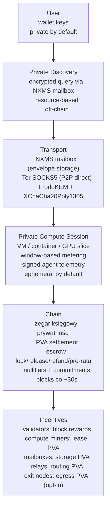

Rules:
- Chain is a privacy accountant — sees commitments, not workloads.
- Discovery is private via NXMS mailbox, not a public registry.
- Sessions are divided into windows — metering is window-based.
- Transport: FrodoKEM heavy once, XChaCha20Poly1305 fast after.

---

## 2. Node Roles

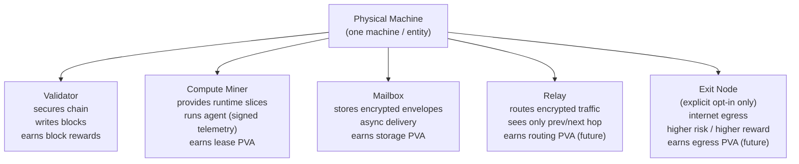

Rules:
- One machine may run multiple roles. Protocol must not merge them.
- Validator ≠ compute miner at protocol level. Two independent keys.
- Exit node is never default. Explicit opt-in only.
- Compute miner runs an agent daemon for signed telemetry.

---

## 3. Compute Lease Lifecycle

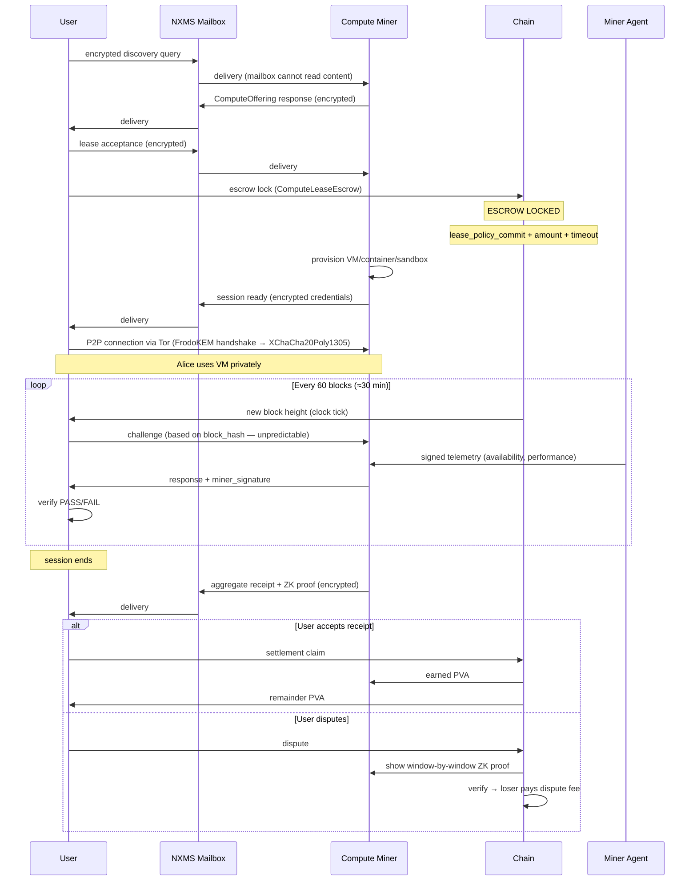

Rules:
- Discovery is private via NXMS mailbox.
- Escrow locks before session starts.
- Windows are off-chain — chain is only the clock (block height).
- Challenge uses block_hash — unpredictable before block, deterministic after.
- Receipt is aggregate (total_windows, passed_windows) + ZK proof.
- Settlement = passed/total × amount. Integer arithmetic. Remainder to user.

---

## 4. On-Chain vs Off-Chain Boundary

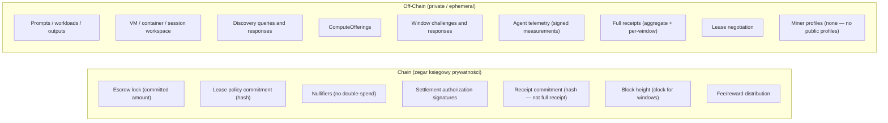

Rules:
- Chain sees commitments, not workloads.
- Chain sees receipt hash, not full receipt.
- Chain sees block height, not window details.
- All off-chain data is ephemeral by default.
- Chain is the clock — windows are built on block heights.

---

## 5. Escrow Boundary

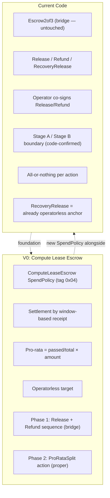

Rules:
- Escrow2of3 stays untouched — it's the bridge.
- ComputeLeaseEscrow is a new SpendPolicy variant, not an extension.
- Phase 1 pro-rata = Release + Refund sequence (existing mechanics).
- Phase 2 pro-rata = ProRataSplit action (new mechanics).
- RecoveryRelease is the operatorless anchor — proof it works.

---

## 6. Window-Based Metering

```mermaid
sequenceDiagram
    participant L as Chain (clock)
    participant U as User
    participant CM as Compute Miner
    participant AGENT as Miner Agent

    Note over L,U,CM: Session starts at block N

    loop Every 60 blocks
        L->>L: new block produced
        L->>U: block_hash(height) is known
        U->>U: challenge = hash(session_id || window_id || block_hash)
        U->>CM: challenge via NXMS
        AGENT->>CM: signed telemetry snapshot
        CM->>CM: compute response
        CM->>U: response + miner_signature
        U->>U: verify response
        U->>U: availability check (response in timeout?)
        U->>U: performance check (time < benchmark_floor?)
        U->>U: window_pass = availability AND (performance OR N/A)
    end

    Note over U: Session ends at block N + (1440 × 60)

    CM->>U: aggregate receipt {total_windows, passed_windows, ZK proof}
    U->>U: compare with own data
```

Rules:
- Block height is the clock. Windows are built on blocks.
- Challenge uses block_hash — unpredictable before block, deterministic after.
- Miner agent provides signed telemetry (nvidia-smi, node_exporter, fio).
- User verifies independently.
- Receipt is aggregate, not per-window stream.
- ZK proof confirms consistency, not absolute truth.

---

## 7. Settlement Formula

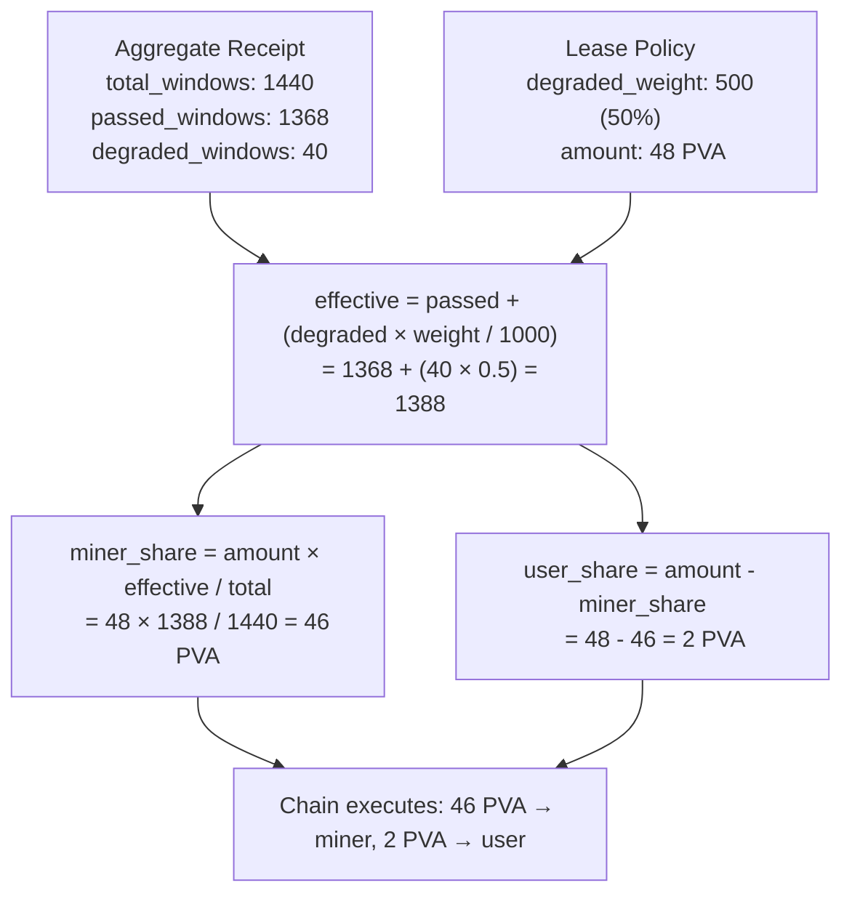

Rules:
- Integer arithmetic only. No floats.
- Remainder always goes to user.
- Degraded windows have configurable weight (default 50%).
- Formula is deterministic — same inputs always give same output.

---

## 8. Receipt Truth Architecture

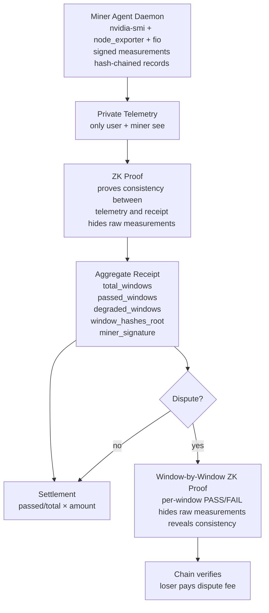

Rules:
- Agent is immutable daemon — signed, hash-chained, tamper-evident.
- ZK proof confirms consistency — does not prove absolute truth.
- Model must be sensible for ZK proof to be meaningful.
- Dispute resolution uses window-by-window proof.
- Benchmark tools (MLPerf, LINPACK, fio, iperf3) are existing industry standards.

---

## 9. Identity (Phase 0-5)

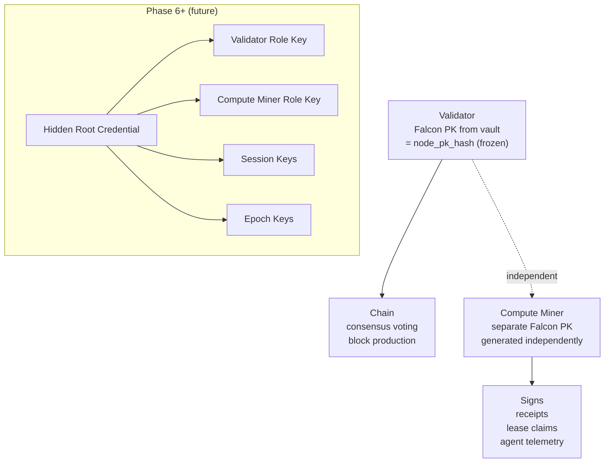

Rules:
- Phase 0-5: two independent keys (validator + compute miner).
- Falcon is a signing tool, not identity.
- Validator identity is frozen — cannot be changed.
- Hidden root is Phase 6+ concern.
- Compute miner key is separate from validator key.

---

## 10. Transport

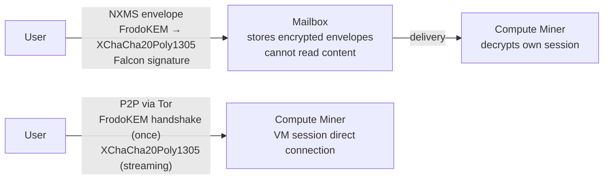

Rules:
- NXMS mailbox: each envelope has own FrodoKEM. Heavy but independent.
- P2P direct: FrodoKEM handshake once, then XChaCha20Poly1305. Fast.
- Mailbox for: discovery, challenges, receipts.
- P2P for: VM session, streaming, terminal.
- Transport metadata hardening is future.

---

## 11. Protocol Version Domains

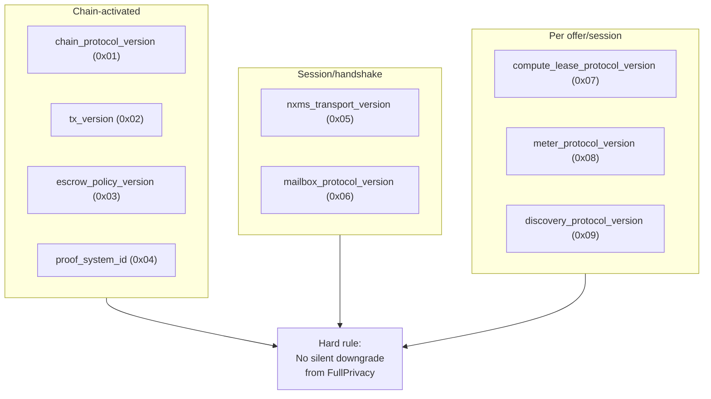

Rules:
- 9 version domains — all defined in `privai-chain/src/versioning.rs`.
- Each domain versioned independently.
- Chain-activated: by height or epoch.
- Handshake-negotiated: NXMS transport, mailbox.
- Declared per session: lease, meter, discovery.
- No silent downgrade from FullPrivacy. Ever. (enforced by `VersionRegistry::negotiate()`)

Code:
- `VersionDomain` enum (9 variants, tag 0x01-0x09)
- `VersionActivation` enum (ChainActivated, Handshake, DeclaredPerSession)
- `VersionRegistry` (get/set/negotiate, no-downgrade check)
- `VersionError::DowngradeRejected` (hard rule enforcement)
- 10 tests (roundtrip, activation, names, registry, no-downgrade)

---

## 12. What Is Rejected

```mermaid
flowchart LR
    subgraph REJECTED["NOT V0"]
        R1["Public AI marketplace"]
        R2["Public provider profile"]
        R3["Quality-of-answer settlement"]
        R4["Operator as canonical decision-maker"]
        R5["MarketplaceBatchTx as product center"]
        R6["Public reputation leaderboard"]
        R7["Artifact delivery as center"]
    end

    subgraph CANONICAL["V0"]
        C1["Private compute network"]
        C2["Window-based metering"]
        C3["Receipt / settlement by availability"]
        C4["Operatorless escrow by design"]
        C5["2 independent keys (Phase 0-5)"]
        C6["NXMS mailbox discovery"]
        C7["Chain = privacy accountant"]
    end

    REJECTED -->|"replaced by"| CANONICAL
```

---

*Document version: 2026-04-12. Updated after system core draft. Window-based metering, simple identity (2 keys), NXMS mailbox discovery, ZK proof receipt architecture, existing benchmark tools.*

