# privAI Production System Diagrams

This file is the visual companion to:
- `PRIVAI_PRODUCTION_SYSTEM_DIRECTION.md`
- `PRIVAI_TOR_GATED_NETWORK_DIRECTION.md` (topology design note — diagrams here show direction, not final hop count)

It exists to keep the production direction easy to scan without re-reading long prose.

## 1. Production Stack [frozen direction]

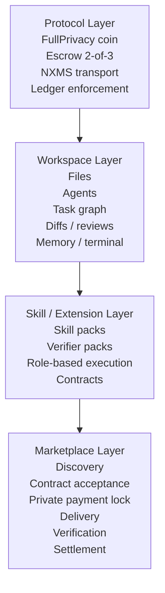

## 2. Service Lifecycle [frozen direction]

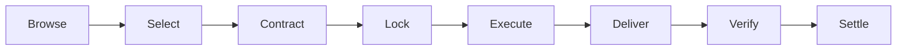

Notes:
- `privAI` already has strong primitives for `Lock -> Execute -> Verify -> Settle`
- the weakest / least-defined areas are `Browse -> Select -> Contract`

## 3. Verification Model [frozen direction]

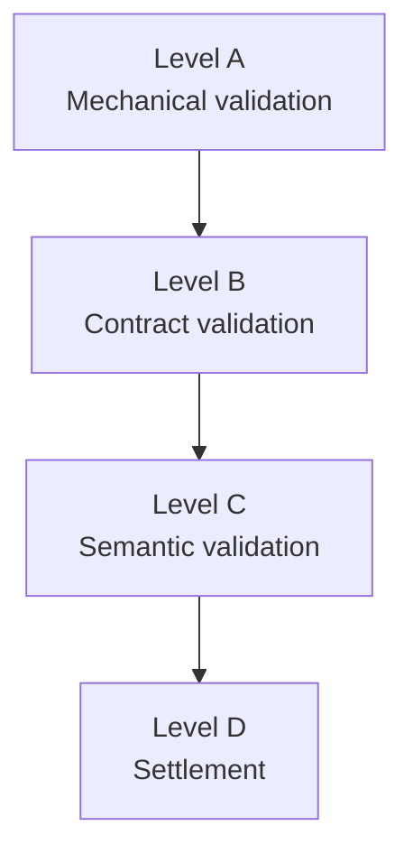

### Level A
- build
- tests
- lint
- schema
- forbidden files untouched

### Level B
- task pill completed
- scope respected
- DoD met

### Level C
- human or reviewer-level judgment
- architecture fit
- semantic correctness

### Level D
- release
- refund
- recovery

## 4. Delivery vs Quality [frozen direction]

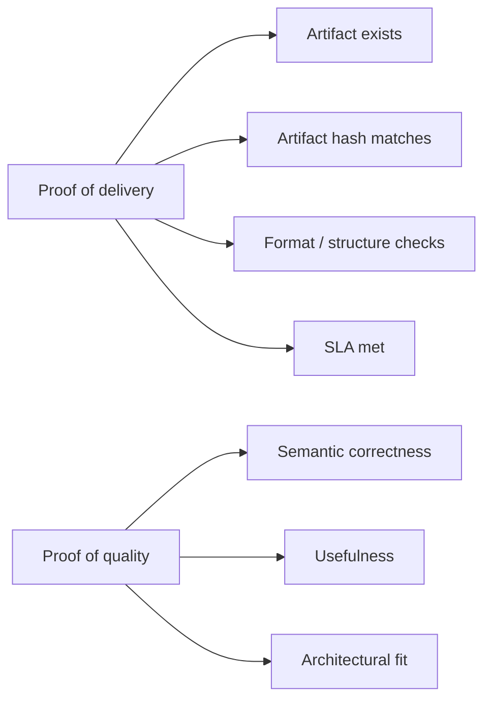

Rule:
- proof of delivery is **not** proof of quality

## 5. Settlement Mapping [frozen direction]

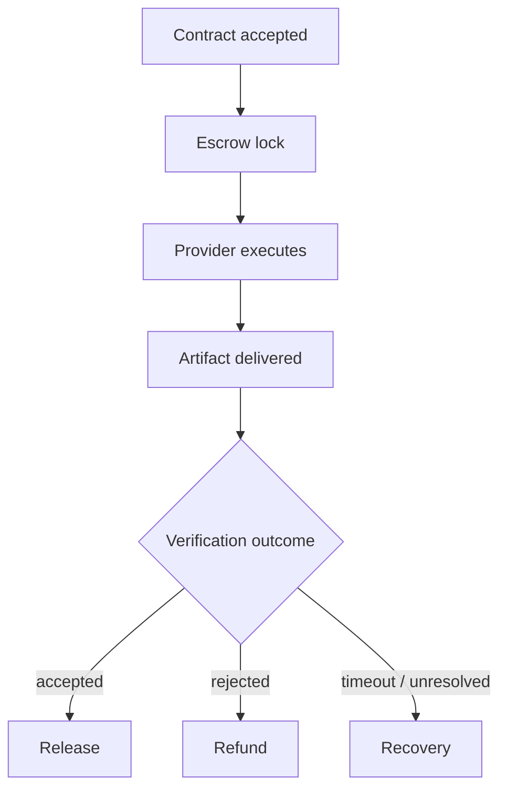

## 5A. On-Chain Privacy Model [frozen direction]

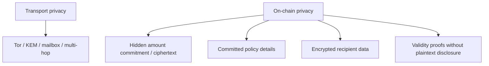

Observer model:
- buyer + provider know the quoted price and contract terms off-chain
- observers see a valid settlement transition, not plaintext amount or recipient
- on-chain marketplace activity must preserve `privAI` privacy, not publish business metadata

## 6. Operator And Dispute Model [frozen direction]

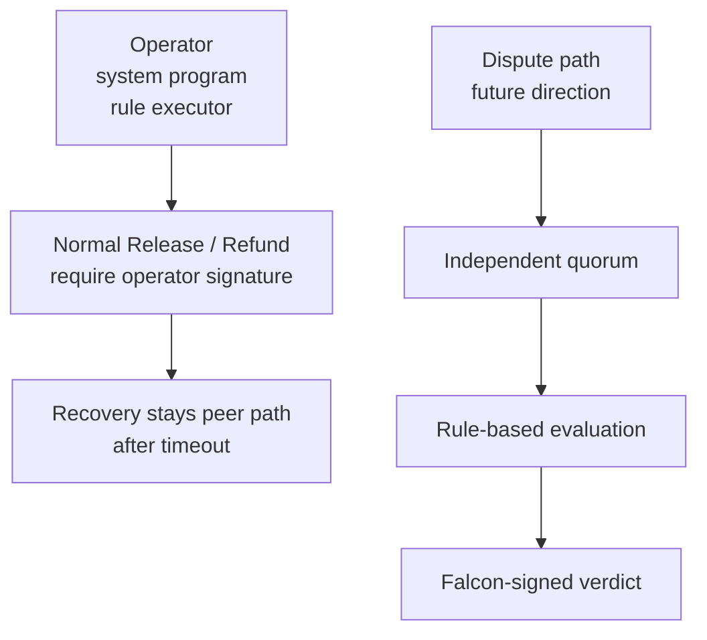

Rules:
- operator is not a casual moderator
- operator is a protocol-role executor
- normal Release / Refund are operator-signed
- future dispute quorum should be procedural, not discretionary

## 7. Frontend Direction [frozen direction]

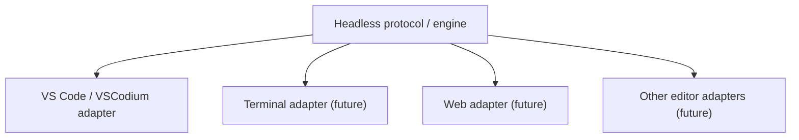

Production direction:
- protocol-first
- first adapter in VS Code / VSCodium style environment
- no shell fork for now

## 8. Connectivity Modes [frozen direction]

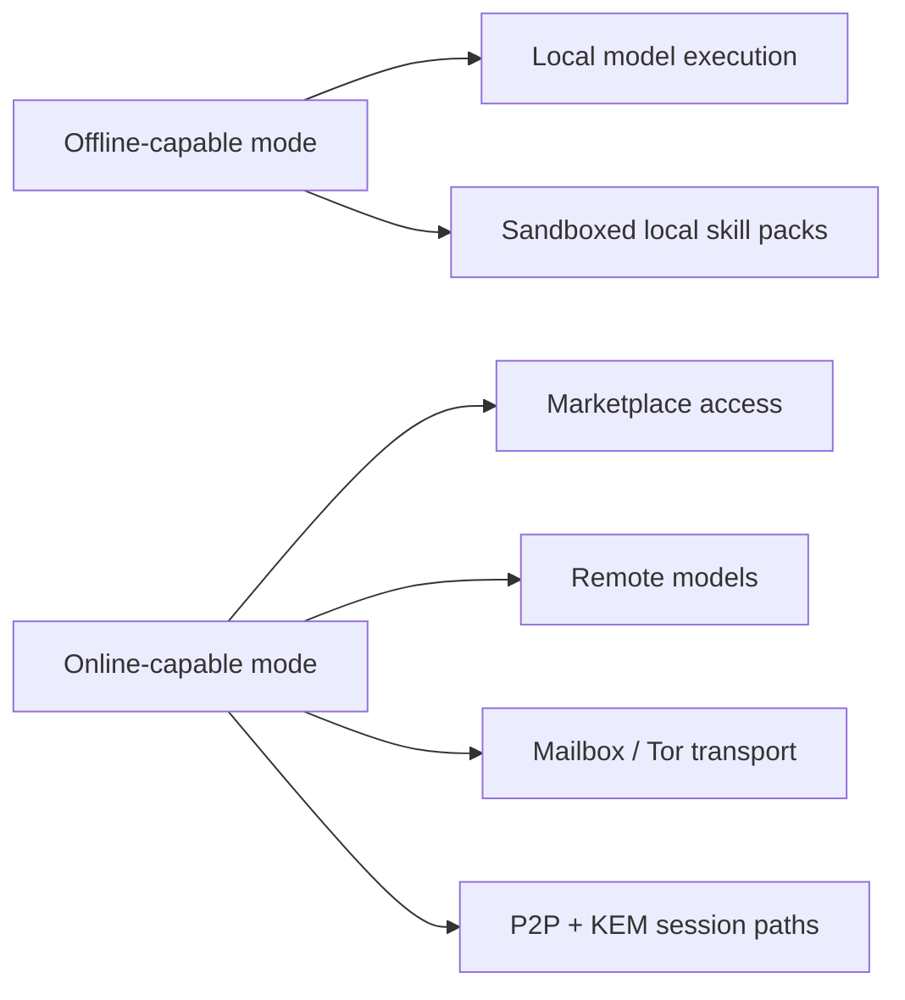

Rule:
- the system should be offline-capable, not offline-only
- the system should be online-capable, not online-required for every workflow

## 9. Trust Direction [frozen direction]

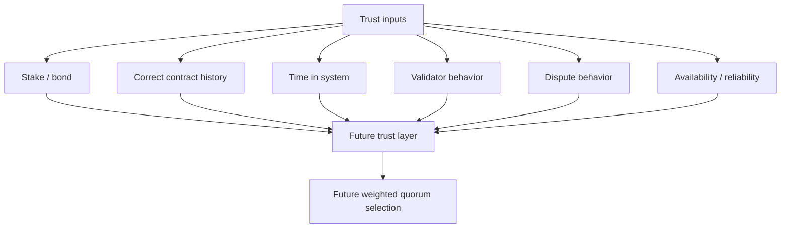

Rule:
- trust should not start as a naive score
- trust should be expensive to gain and expensive to lose

## 10. Execution Modes (A-D) [frozen direction]

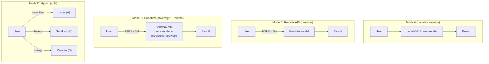

Key:
- Mode A: no network, maximum privacy
- Mode B: provider sees prompt (decrypted for inference)
- Mode C: provider sees resource usage only, NOT content/model/prompts
- Mode D: routing logic defined in skill contract

## 11. Sandbox Network: ISOLATED (default) [frozen direction]

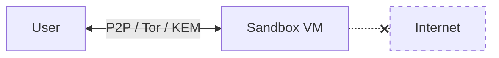

- VM has NO network interface except tunnel to user
- Provider sees: KEM traffic volume, CPU/GPU usage
- Provider does NOT see: content, model, prompts
- Internet: **NONE**

## 12. Sandbox Network: TOR-GATED (direction) [design direction]

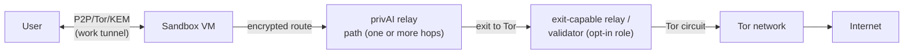

Visibility direction:

| Who | Sees | Does NOT see |
|-----|------|-------------|
| Provider | encrypted outbound traffic | destination, content, route details |
| privAI relay (any hop) | previous + next hop only | content, full route, contract details |
| Exit-capable relay / validator | traffic toward Tor / internet | origin identity, full route, content |
| Tor Exit | destination IP | provider identity, private route metadata |
| Destination | Tor Exit IP | everything else |

Frozen properties:
- Sandbox speaks ONLY privAI protocol (no direct Tor client in VM)
- Relay hop count and topology are network-design parameters (see `PRIVAI_TOR_GATED_NETWORK_DIRECTION.md`)
- Internet-exit is an explicit opt-in network role
- Each relay knows only its immediate neighbors (onion model)
- No single node learns the full path
- Provider cannot determine whether traffic is destined for the internet

## 13. FullPrivacy Marketplace / Generic Escrow Lifecycle [frozen direction]

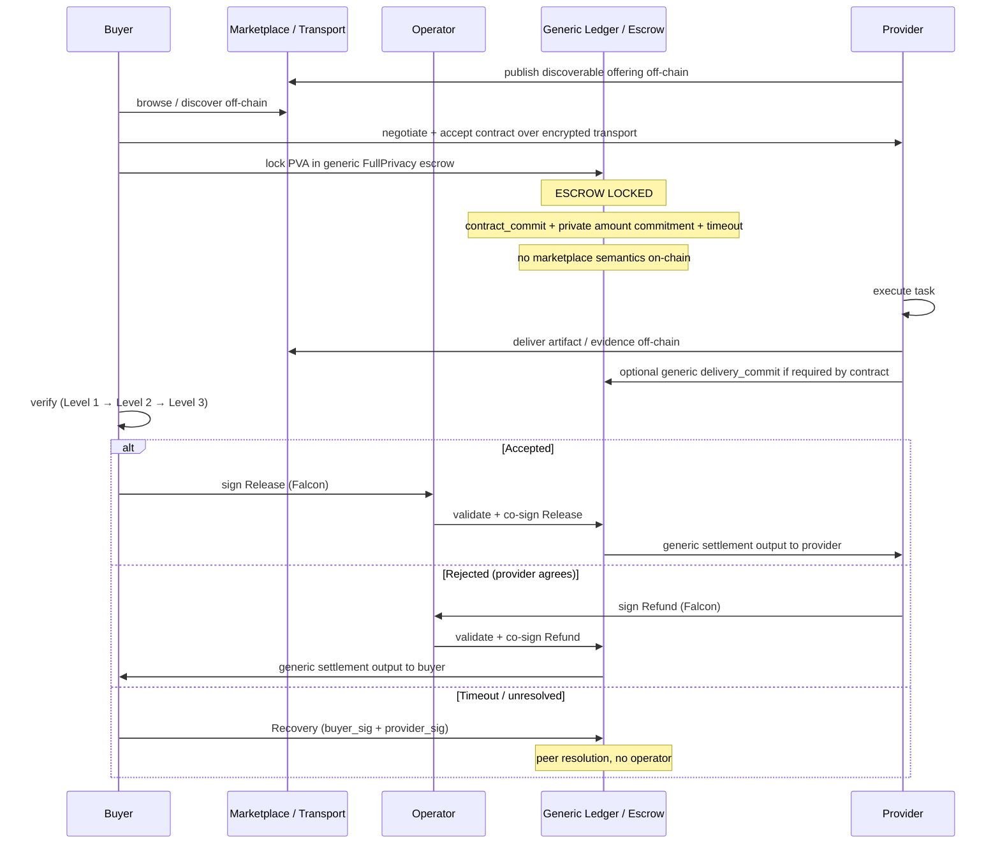

Rules:
- marketplace is the off-chain application/protocol layer
- escrow is on-chain but generic
- the chain does not store skill pack, discovery, task text, or marketplace profile semantics
- `MarketplaceBatchTx` is optional aggregate rail, not the FullPrivacy marketplace baseline

## 14. Skill Pack Structure [frozen direction]

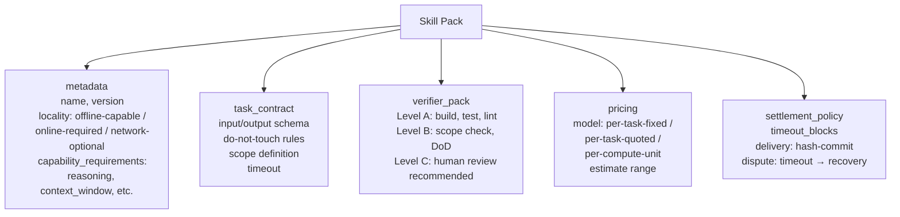

## 15. Full Network Topology (direction) [design direction]

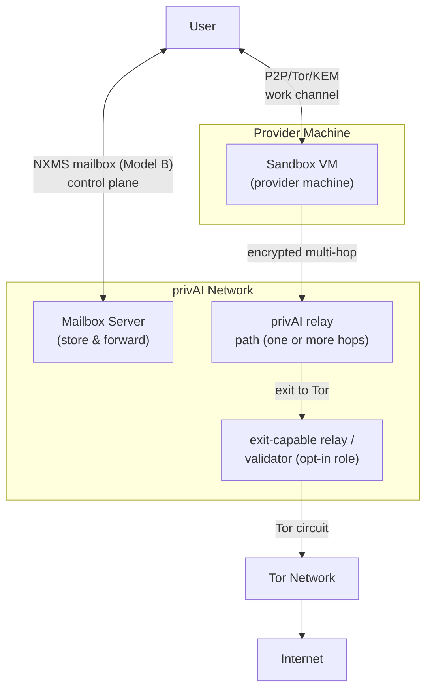

Provider visibility: KEM-encrypted packets leaving sandbox, CPU/GPU metrics.
Provider does NOT see: destinations, content, Tor traffic, routing path.
privAI relay visibility: only immediate predecessor and successor (onion model).
Exit-capable relay / validator visibility: traffic to route via Tor (not origin).
Separation of duty: Provider != relays != exit-capable relay / validator.

## 16. Rollout Phases [frozen direction]

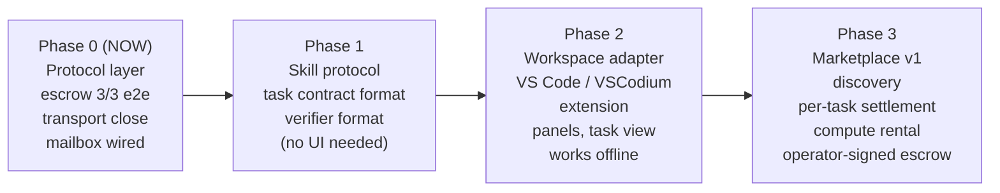

---

## 17. Verification Failure Paths [frozen direction]

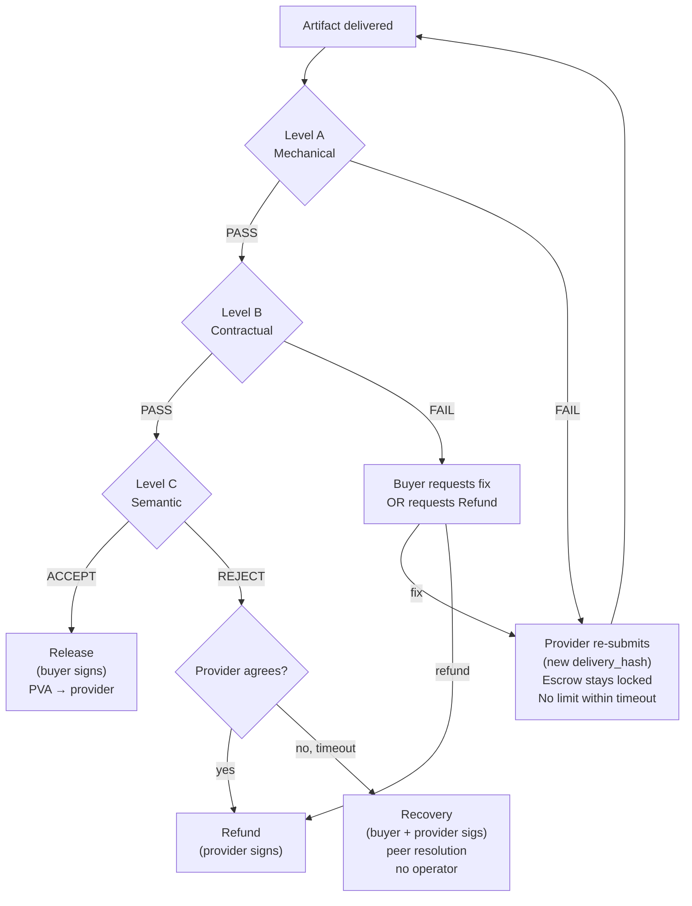

## 18. Operator Transition [frozen direction]

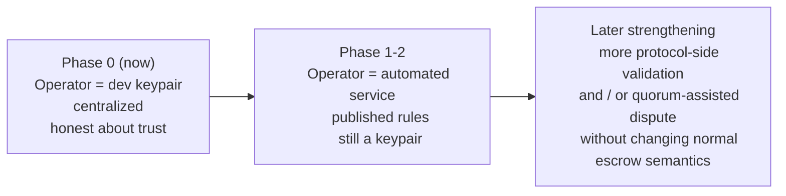

## 19. Scope Change Protocol [frozen direction]

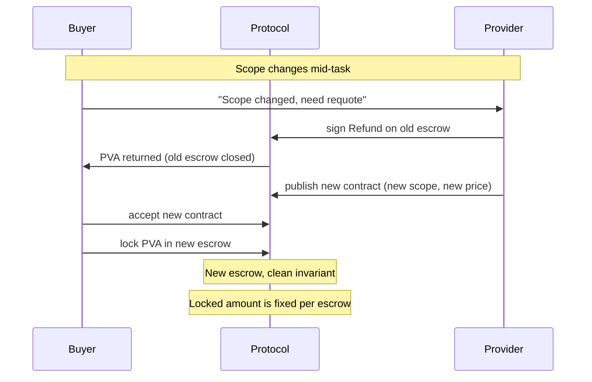

---

*Document version: 2026-04-10. Reflects 22 frozen decisions from PRIVAI_PRODUCTION_SYSTEM_DIRECTION.md. Multi-hop sandbox network direction — exact relay topology is a design parameter, not a product invariant (see PRIVAI_TOR_GATED_NETWORK_DIRECTION.md).*
